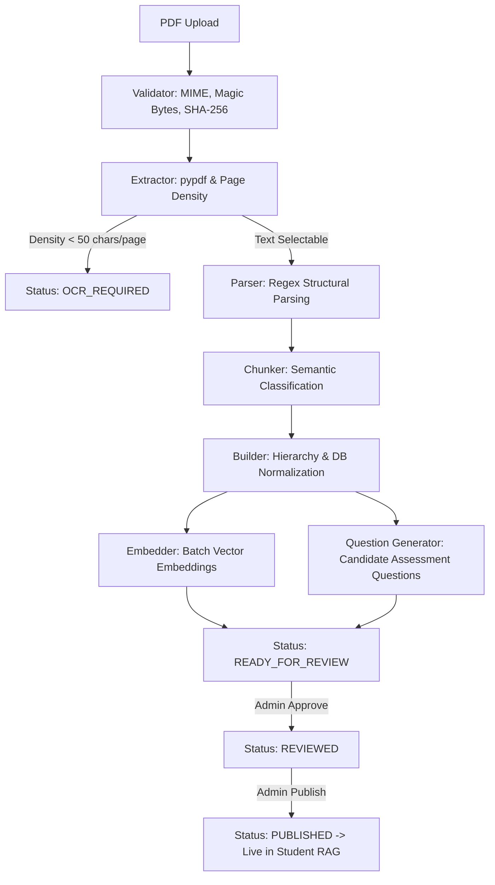

# Production-Grade Curriculum Ingestion Pipeline

The Curriculum Ingestion Pipeline transforms raw school textbook PDFs (NCERT Class 8 Science, etc.) into an authoritative, hierarchical, source-grounded curriculum database.

---

## 1. Core Engineering Principles

1. **Hierarchy Preservation (Never Flatten Textbooks)**: Textbooks are never flattened into arbitrary text chunks. The hierarchy is rigorously preserved:
   $$\text{Document} \longrightarrow \text{Subject} \longrightarrow \text{Book} \longrightarrow \text{Chapter} \longrightarrow \text{Section} \longrightarrow \text{Topic} \longrightarrow \text{Concept} \longrightarrow \text{Learning Objective} \longrightarrow \text{Content Chunk}$$
2. **Deterministic Source Traceability**: Every extracted chunk retains immutable textbook citations (`book_id`, `chapter_id`, `section_id`, `page_start`, `page_end`, `heading_path`).
3. **Idempotency & Duplicate Prevention**: Uploaded files compute a SHA-256 hash immediately. Duplicate uploads return the existing document record without re-running CPU/GPU-intensive extraction.
4. **Selectable Text Validation & Scanned PDF Gate**: Evaluates average character density per page ($> 50$ chars/page threshold). PDFs with missing text layers transition to `OCR_REQUIRED` without crashing or ingesting empty chunks.
5. **Gated RAG & Administrative Approval**: Extracted units remain in `DRAFT` status under a document in `READY_FOR_REVIEW`. Student sessions and RAG retrievers only access units explicitly marked `PUBLISHED`.

---

## 2. Pipeline Architecture & Execution Stages

### Ingestion Stages
1. **`VALIDATING`**:
   - Inspects file extension (`.pdf`), MIME type (`application/pdf`), and magic bytes (`%PDF-`).
   - Enforces 50MB file size ceiling.
   - Computes SHA-256 content hash for duplicate detection.
2. **`EXTRACTING`**:
   - Extracts text page-by-page preserving accurate 1-indexed page boundaries.
   - Computes text density. Flags document as `OCR_REQUIRED` if text layer is absent.
3. **`STRUCTURING`**:
   - Parses chapter title, number, sections (e.g., `4.1`, `4.2`), activities (`Activity 4.1`), figures (`Fig 4.1`), and textbook exercises.
4. **`CHUNKING`**:
   - Semantic chunker segments text into discrete pedagogical units (300–800 chars) preserving complete sentences.
   - Classifies chunks into taxonomy types: `definition`, `experiment`, `explanation`, `example`, `table`, `summary`, `exercise`.
5. **`EMBEDDING`**:
   - Computes dense vector representations for all chunks via `AIProvider.generate_embeddings`.
6. **`GENERATING_CONTENT`**:
   - Extracts high-yield concepts, difficulty tiers (1–3), and Bloom's taxonomy objectives.
   - Generates candidate MCQ and explanation questions linked directly to source chunks.
7. **`READY_FOR_REVIEW`**:
   - Marks document and unverified hierarchy as draft units awaiting parental or teacher review.
8. **`PUBLISHED`**:
   - Atomic multi-table transition: updates Document, Chapter, Section, Topic, Concept, ContentChunk, and Question records to `PUBLISHED` / `is_published = True`.

---

## 3. Semantic Chunk Classification Taxonomy

| Content Type | NCERT Indicators / Heuristics | Example in Class 8 Science |
| :--- | :--- | :--- |
| `definition` | "is called", "is known as", "defined as" | *"A chemical process in which a substance reacts with oxygen to give off heat is called combustion."* |
| `experiment` | "Activity X.Y", "Materials required", "Observe" | *Activity 4.1: Collect materials like straw, matchsticks, kerosene oil...* |
| `explanation` | Conceptual elaboration, mechanics, causation | *How water cools combustible materials below their ignition temperature.* |
| `example` | "For example", "such as", "for instance" | *Charcoal burning in air to produce carbon dioxide, heat, and light.* |
| `summary` | "What you have learnt", "Key points" | *Chapter summary bullets summarizing fuels, ignition, and flame zones.* |
| `exercise` | "Questions", "Fill in the blanks", "Exercises" | *End-of-chapter textbook review questions.* |

---

## 4. API Endpoints

- `POST /api/v1/curriculum/upload` (Multipart PDF, RBAC Parent/Admin required)
- `GET /api/v1/curriculum/documents` (List all documents, status badges, extraction metrics)
- `GET /api/v1/curriculum/documents/{id}/status` (Lightweight polling endpoint)
- `POST /api/v1/curriculum/documents/{id}/approve` (Mark document `REVIEWED`)
- `POST /api/v1/curriculum/documents/{id}/publish` (Atomically activate chunks in student RAG)
- `PATCH /api/v1/curriculum/concepts/{id}` (Edit concept name, summary, tier, or status before publishing)
